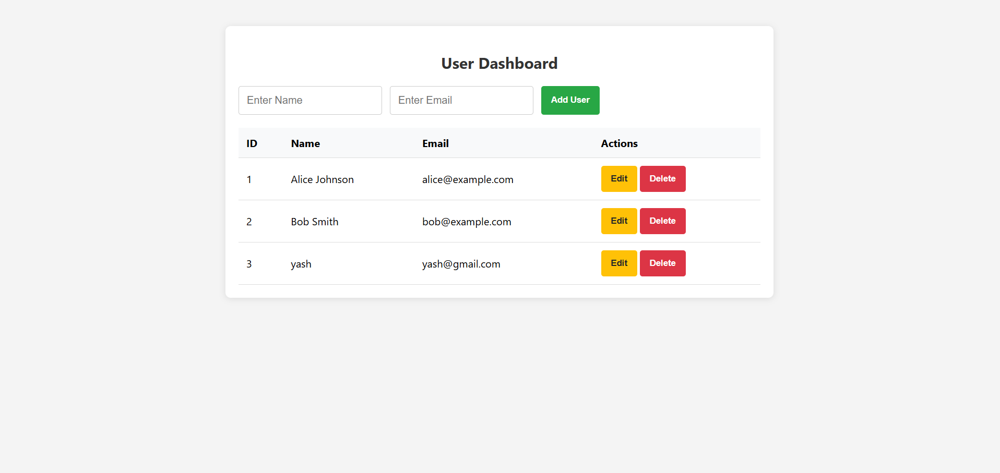
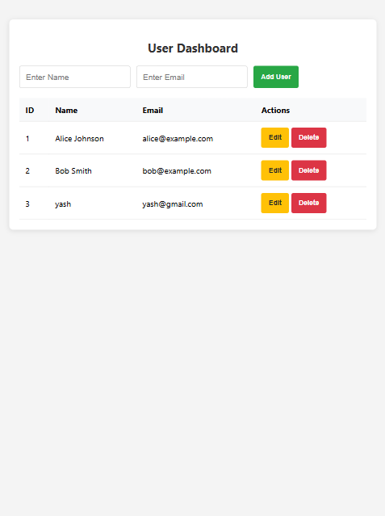
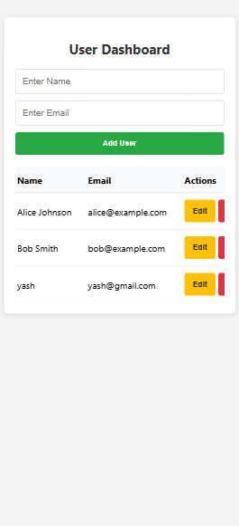

# User Management Dashboard (CRUD)

A simple yet powerful **User Management System** that allows users to perform Create, Read, Update, and Delete operations. This project focuses on DOM manipulation and state management using Vanilla JavaScript.

## Project Gallery

### Screenshot 1

### Screenshot 2

### Screenshot 3

## 🚀 Features
* **Create**: Add new users with a name and email.
* **Read**: View all users in a dynamically updated, clean table format.
* **Update**: Edit existing user details with a single click.
* **Delete**: Remove users from the list instantly.
* **Responsive Design**: A clean, centered layout that works on different screen sizes.
* **Form Validation**: Simple checks to ensure fields are not empty before submission.

## 🛠️ Tech Stack
* **HTML5**: Semantic structure for the dashboard and table.
* **CSS3**: Custom styling with a focus on clean typography and UI components.
* **JavaScript (ES6+)**: Functional logic for CRUD operations and dynamic DOM updates.

## 📂 Project Structure
* `index.html` - The main UI structure.
* `style.css` - Custom styles for the dashboard and buttons.
* `javascript.js` - Logic for managing user data and table rendering.
